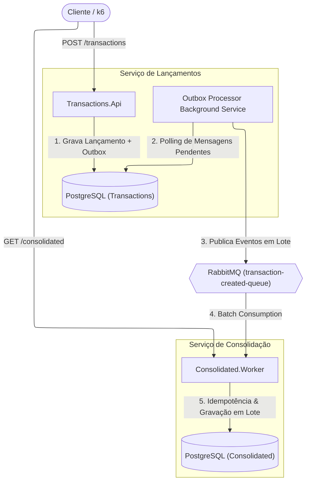
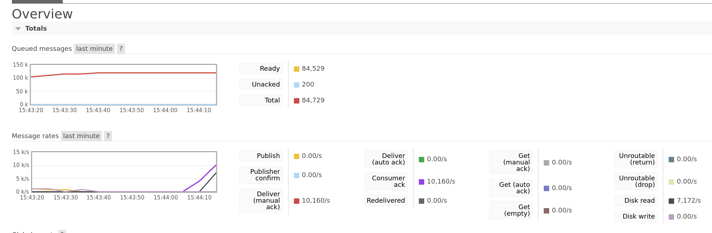

# Fluxo de Caixa & Saldo Consolidado Diário

Sistema corporativo de gestão de lançamentos financeiros (créditos e débitos) e relatórios de saldo diário consolidado, desenvolvido em **.NET 10 (C#)** utilizando princípios de **Clean Architecture**, **SOLID** e **CQRS**.

---

## Visão Geral da Arquitetura

O sistema foi desenhado para garantir **alta resiliência**, **desacoplamento total** e **alta vazão de processamento** (suportando picos de mais de 50 chamadas por segundo com tolerância a falhas).

---

## Requisitos do Sistema

### Requisitos Funcionais (RF)
* **RF01 - Gestão de Lançamentos Financeiros**: A API principal (`Transactions.Api`) permite o registro de lançamentos de **Crédito** (tipo 1) e **Débito** (tipo 2), contendo valor, moeda e descrição.
* **RF02 - Saldo Consolidado Diário**: O serviço de consolidação (`Consolidated.Worker`) fornece a consulta do saldo consolidado contendo total de créditos, total de débitos e saldo líquido final.
* **RF03 - Consulta por Data**: Permite consultar o saldo consolidado de uma data específica (`/consolidated?date=YYYY-MM-DD`) ou obter o saldo do dia atual por padrão (`/consolidated`).

### Requisitos Não Funcionais (RNF) & Decisões de Arquitetura
* **RNF01 - Resiliência e Desacoplamento**: A aplicação de gestão de lançamentos é completamente desacoplada do serviço de consolidação. Caso o worker ou o banco de consolidação fiquem indisponíveis, a API de lançamentos continua operante sem nenhuma interrupção ao usuário.
* **RNF02 - Processamento de Pico & Alta Vazão**: Para suportar picos de **50+ requisições por segundo**, o worker realiza **consumo em lote (Batching)** e agrupamento em memória antes da persistência no banco de dados, reduzindo drasticamente o número de I/O em disco.
* **RNF03 - Idempotência e Confiabilidade**: O consumidor garante idempotência através do registro de transações processadas (`ProcessedTransaction`), impedindo que mensagens duplicadas na fila afetem o saldo diário.
* **RNF04 - Observabilidade Ponta a Ponta**: Telemetria completa integrada com OpenTelemetry, rastreamento distribuído, métricas centralizadas e visualização de logs no Grafana.

---

## Como Executar o Projeto

### Pré-requisitos
* **Docker** e **Docker Compose** (ou **Podman** / **Podman Compose**).
* **.NET 10 SDK** *(opcional, apenas para rodar os testes ou compilar/executar localmente sem container)*.

### Passo a Passo

1. **Clonar o Repositório**:
   ```bash
   git clone https://github.com/crashunix/FluxoCaixa
   cd FluxoCaixa
   ```

2. **Subir os Containers**:
   Execute o comando abaixo na raiz do projeto para compilar e iniciar todos os serviços:
   ```bash
   docker compose up --build
   ```
   *(Ou `podman compose up --build` caso utilize Podman)*.

3. **Acessar os Serviços**:

| Serviço | URL | Descrição |
| :--- | :--- | :--- |
| **Transactions API (Scalar)** | `http://localhost:5001/scalar/v1` | Documentação e testes interativos dos Lançamentos. |
| **Consolidated Worker (Scalar)**| `http://localhost:5002/scalar/v1` | Documentação e testes interativos da Consolidação. |
| **Grafana Dashboards** | `http://localhost:3000` | Painéis de Métricas e Logs (Login: `admin` / `admin`). |
| **RabbitMQ Management** | `http://localhost:15672` | Painel da fila (Login: `guest` / `guest`). |

---

## Arquivos de Requisição HTTP & Postman Collection (`/docs`)

Para facilitar os testes manuais dos endpoints dos microsserviços, o diretório [`/docs`](docs/) inclui arquivos prontos para execução de chamadas HTTP:

* **[docs/FluxoCaixa.http](docs/FluxoCaixa.http)**:
  Arquivo unificado de requisições `.http` contendo chamadas para a **Transactions.Api** (Porta 5001) e para o **Consolidated.Worker** (Porta 5002). Suportado nativamente no VS Code (extensões REST Client / HTTP Client), JetBrains Rider e Visual Studio.
* **[docs/FluxoCaixa.postman_collection.json](docs/FluxoCaixa.postman_collection.json)**:
  Coleção estruturada para ser importada diretamente no **Postman** ou **Insomnia**.

---

## Execução dos Testes Automatizados

O projeto possui testes unitários e de integração cobrindo regras de domínio, comandos MediatR, concorrência e repositórios.

Para rodar todos os testes da solução, execute:

```bash
dotnet test
```

---

## Testes de Carga (k6)

O projeto inclui um script de teste de carga em k6 (`tests/load-test.js`) simulando acessos em rajada e picos de até **100 usuários virtuais (VUs)** concorrentes enviando lançamentos para a `Transactions.Api`.

### Resultados do Teste de Carga

| Métrica | Valor Obtido | Requisito / Limiar (Threshold) |
| :--- | :--- | :--- |
| **Vazão Total (Throughput)** | **634 req/s** (38.062 requisições em 1 min) | ≥ 50 req/s |
| **Taxa de Erro (`http_req_failed`)** | **0.00%** (0 falhas) | $<$ 1.00% (Tolerância máx 5%) |
| **Latência Média (`avg`)** | **12.06 ms** | N/A |
| **Latência Mediana (`med`)** | **4.93 ms** | N/A |
| **Percentil 90 (`p90`)** | **11.78 ms** | N/A |
| **Percentil 95 (`p95`)** | **74.62 ms** | $<$ 200 ms |

### Como Executar o Teste de Carga

#### Opção A: Via Container (Docker / Podman - Sem instalação local)
```bash
docker run --rm -i --network=host grafana/k6 run - < tests/load-test.js
```
*(Ou `podman run --rm -i --network=host grafana/k6 run - < tests/load-test.js` caso utilize Podman)*.

#### Opção B: Via CLI Local do k6
```bash
k6 run tests/load-test.js
```

---

## Processamento e Drenagem da Fila no RabbitMQ

Durante picos de carga (como demonstrado nos testes de estresse com o **k6**), o volume de mensagens publicadas via **Transactional Outbox** acumula temporariamente na fila `transaction-created-queue` do RabbitMQ.

O **Consolidated Worker** processa as mensagens em lotes (*batch processing* de até 200 mensagens) com prefetch otimizado e confirmações (*acknowledgements*) em lote. Isso resulta em uma drenagem de alta velocidade, mantendo o tempo de residência das mensagens na fila mínimo e garantindo a consolidação do saldo com alta eficiência.



*Gráfico do painel de gerenciamento do RabbitMQ (`http://localhost:15672`) ilustrando o pico de entrada de mensagens durante o teste de carga seguido pela rápida curva de drenagem e esvaziamento completo da fila pelo Worker.*

---

## Decisões de Engenharia & Resiliência

1. **Transactional Outbox Pattern**:
   Para evitar inconsistências de dados e o problema de *Dual Write*, a API não publica mensagens diretamente no RabbitMQ durante o tratamento da requisição HTTP. Em vez disso, o lançamento financeiro e a mensagem de evento são gravados na tabela `OutboxMessage` em uma **transação única e atômica** no PostgreSQL. Um processo em segundo plano (`OutboxProcessorBackgroundService`) lê ciclicamente as mensagens pendentes da Outbox e as envia de forma confiável para o RabbitMQ (*at-least-once delivery*).

2. **Desacoplamento Assíncrono com Mensageria**:
   A comunicação entre a API de Lançamentos e o Worker de Consolidação é feita exclusivamente via **RabbitMQ**. Isso garante que indisponibilidades momentâneas no Worker não afetem a criação de lançamentos na API.

3. **Processamento em Lote (Batching)**:
   Em vez de abrir uma transação no banco de dados para cada mensagem recebida da fila, o consumidor lê mensagens em lotes (até 200 mensagens ou por tempo de janela), consolida os valores em memória e faz a atualização do saldo com uma única transação no banco de dados.

4. **Garantia de Idempotência**:
   Cada mensagem consumida é registrada na tabela `ProcessedTransaction`. Se o RabbitMQ entregar a mesma mensagem mais de uma vez, o Worker ignora a duplicação sem alterar os totais de crédito e débito.

5. **Tratamento de Erros e Retries**:
   Utilização de estratégias de resiliência com **Polly** para gerenciar reconexões exponenciais com o RabbitMQ e execução resiliente com o Entity Framework Core em cenários de oscilação do banco.

---

## Práticas de Engenharia & Tecnologias

* **Domain-Driven Design (DDD) & Domínios Ricos**:
  * Regras de negócio fortemente encapsuladas em entidades e *Value Objects* imutáveis (`Money`).
  * Utilização de **Domain Exceptions** para expressar semanticamente violações de regras de negócio.
* **Clean Architecture & CQRS**:
  * Separação rigorosa das camadas de responsabilidade (`Domain`, `Application`, `Infrastructure`, `Api`/`Worker`).
  * Padrão CQRS com **MediatR** desacoplando manipuladores de comandos da camada de apresentação.
* **Validação & Tratamento Global de Exceções**:
  * **FluentValidation** para validações declarativas na entrada das requisições.
  * **Global Exception Handler** para interceptar falhas e retornar respostas padronizadas em conformidade com o padrão RFC 7807 (*ProblemDetails*).
* **Pipeline Behaviors & AOP com MediatR**:
   Tratamento de preocupações transversais (*Cross-Cutting Concerns*) desacoplado através de `IPipelineBehavior`, executando validação declarativa (`ValidationBehavior` via FluentValidation) e instrumentação de telemetria (`TracingBehavior`) antes do manipulador de comandos.
* **Arquitetura Limpa com Extension Methods**:
  * Registro modular de serviços e dependências utilizando **Extension Methods** para manter a inicialização do `Program.cs` legível.
* **Orquestração Modular (Docker Compose `include`)**:
  * Utilização do recurso `include` do Docker Compose v2 para separar os arquivos de compose por microsserviço de forma limpa.
* **Observabilidade (OpenTelemetry & Serilog)**:
  * Logs estruturados com **Serilog**.
  * Rastreamento distribuído (Tracing) e exportação OTLP via **OpenTelemetry** integrados ao ecossistema de observabilidade.
* **Distributed Context Propagation (OpenTelemetry & ActivityLink)**:
   A rastreabilidade fim a fim (End-to-End Tracing) é mantida mesmo através do desacoplamento assíncrono do Transactional Outbox. O `TraceId` e `SpanId` gerados na chamada HTTP são persistidos na Outbox e correlacionados aos lotes de envio via `ActivityLink`, injetando os cabeçalhos W3C `traceparent` no RabbitMQ para visualização unificada no Jaeger.
* **Otimização de Índices Parciais (Filtered Indexes)**:
   A tabela de `OutboxMessages` utiliza índices parciais no PostgreSQL (`WHERE "ProcessedAtUtc" IS NULL`). Isso garante que a rotina de polling em segundo plano leia apenas mensagens pendentes, mantendo o custo de I/O e tempo de consulta estáveis mesmo após milhões de registros processados.

---

## Melhorias Futuras

* **Autenticação & Autorização (JWT / OAuth2)**:
  Implementação de controle de acesso seguro através de JWT e suporte a *Multi-tenancy* para isolar os dados por comerciante/conta.
* **Cache Distribuído com Redis**:
  Adição de camada de cache em memória (Redis) para as consultas de saldo consolidado (`GET /consolidated`), reduzindo a carga no banco de dados através do padrão *Cache-Aside* com invalidação orientada a eventos.
* **Tratamento de Mensagens Mortas (Dead Letter Queue - DLQ)**:
  Configuração de Dead Letter Exchange/Queue no RabbitMQ para isolamento e análise manual de mensagens com falhas irrecuperáveis após esgotamento das tentativas de retry.
* **Escalabilidade com Kubernetes & KEDA**:
  Empacotamento em manifestos Kubernetes utilizando **KEDA** para ajustar dinamicamente o número de réplicas do Worker com base no volume de mensagens na fila.
* **Painel Web (Frontend em Tempo Real)**:
  Construção de um dashboard web integrado via **WebSockets** ou **Server-Sent Events** para atualizar em tempo real a curva de saldos e gráficos de lançamentos diários.
